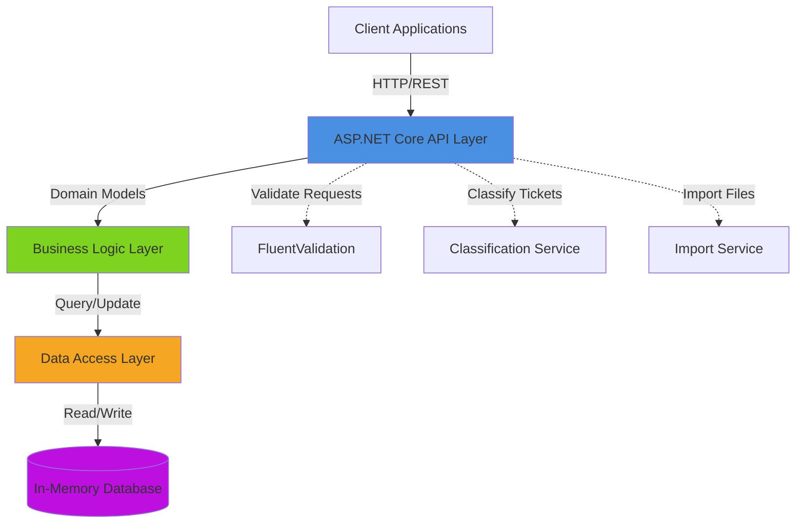
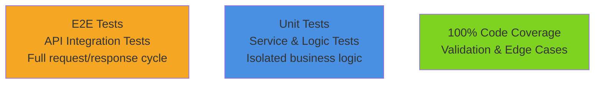

# Support Ticket Management System API

> **Student Name**: Vlad Bairak
> **Date Submitted**: 2026-05-17
> **GitHub Username**: vb-gen-ai
> **AI Tools Used**: Claude Code, Claude Haiku (code review), Anthropic API

---

## 📋 Project Overview

The Support Ticket Management System is a modern ASP.NET Core REST API that provides comprehensive ticket management capabilities for support operations. The system enables creation, retrieval, updating, and deletion of support tickets, with advanced features including batch import from CSV/JSON/XML formats, automatic classification using keyword-based heuristics, and flexible filtering by category, priority, and status.

### Key Features

- **Full CRUD Operations**: Create, read, update, and delete support tickets
- **Batch Import**: Import tickets from CSV, JSON, or XML formats in a single operation
- **Automatic Classification**: ML-inspired keyword-based classification to automatically assign category and priority
- **Advanced Filtering**: Filter tickets by category, priority, and status
- **Input Validation**: FluentValidation-based validation with detailed error messages
- **RESTful API Design**: Follows REST conventions with proper HTTP status codes
- **Async/Await**: Fully asynchronous request handling
- **Type Safety**: C# record types for request/response DTOs

### Technology Stack

- **Language**: C# (.NET 10.0 / .NET 11.0)
- **Framework**: ASP.NET Core 10 / 11
- **Database**: EF Core with in-memory storage (testable, no external DB required)
- **Validation**: FluentValidation for robust request validation
- **Testing**: xUnit with FluentAssertions and Moq
- **API Documentation**: OpenAPI/Swagger support

---

## 🏗️ Architecture



### Architecture Decisions

1. **Layered Architecture**: Separates API endpoints, business logic, and data access concerns
2. **In-Memory Storage**: No external database dependency simplifies testing and deployment
3. **Record Types**: Modern C# records provide immutable, concise DTOs
4. **Dependency Injection**: ASP.NET Core DI container manages service lifetimes
5. **Async All The Way**: Every service operation is async-first for scalability

---

## 🚀 Installation & Setup

### Prerequisites

- .NET 10.0 SDK or .NET 11.0 SDK
- PowerShell 5.1 (included with Windows 10/11)
- Git

### Quick Start

1. **Clone and navigate to the homework directory:**
   ```powershell
   cd "D:\Work\learn\Courses\AI -set\lecture-1\vb_gen-ai-software-engineering\homework-2"
   ```

2. **Build the solution:**
   ```powershell
   dotnet build
   ```

3. **Run tests to verify integrity:**
   ```powershell
   dotnet test
   ```

4. **Start the API server:**
   ```powershell
   cd src\Homework2.Api
   dotnet run
   ```
   The API will be available at `http://localhost:5000` by default.

5. **Test an endpoint:**
   ```powershell
   $uri = "http://localhost:5000/tickets"
   $body = @{
       customerId = "CUST001"
       customerEmail = "user@example.com"
       customerName = "John Doe"
       subject = "Cannot login"
       description = "I'm locked out of my account"
       category = "account_access"
       priority = "high"
   } | ConvertTo-Json
   
   Invoke-RestMethod -Uri $uri -Method POST -ContentType "application/json" -Body $body
   ```

For detailed instructions, see **[HOWTORUN.md](HOWTORUN.md)**.

---

## 📂 Project Structure

```
homework-2/
├── src/
│   ├── Homework2.Api/                  # ASP.NET Core API layer
│   │   ├── Endpoints/                  # Route handlers
│   │   │   ├── TicketsEndpoints.cs    # CRUD operations
│   │   │   ├── TicketsImportEndpoint.cs # Batch import
│   │   │   └── TicketsClassifyEndpoint.cs # Auto-classification
│   │   ├── Models/
│   │   │   └── TicketDtos.cs          # Request/response DTOs
│   │   ├── Validators/
│   │   │   └── TicketValidator.cs     # Input validation rules
│   │   └── Program.cs                  # Startup configuration
│   ├── Homework2.Bll/                  # Business Logic Layer
│   │   ├── Domain/
│   │   │   └── Ticket.cs              # Core domain models & enums
│   │   ├── Services/
│   │   │   ├── TicketService.cs       # Ticket CRUD operations
│   │   │   ├── TicketClassifier.cs    # Classification logic
│   │   │   └── TicketImportService.cs # Import CSV/JSON/XML
│   │   └── Abstractions/
│   │       └── ITicketRepository.cs   # Repository interface
│   └── Homework2.Tests/                # xUnit test suite
│       ├── Unit/                       # Unit tests
│       ├── Integration/                # Integration tests
│       └── TestData/                   # Test fixtures
├── docs/
│   ├── API_REFERENCE.md                # Complete API documentation
│   ├── ARCHITECTURE.md                 # Architecture deep-dive
│   ├── TESTING_GUIDE.md                # Test strategy & coverage
│   └── screenshots/
│       ├── claude-code-desktop.bmp     # Claude Code in action
│       ├── claude-code-interaction.png # AI planning/review interaction
│       └── test_coverage.png           # Test coverage report
├── demo/
│   ├── sample-requests.ps1             # Runnable API demo script
│   ├── sample_tickets.csv              # Sample data (CSV format, 50 rows)
│   ├── sample_tickets.json             # Sample data (JSON format, 20 entries)
│   ├── sample_tickets.xml              # Sample data (XML format, 30 entries)
│   └── invalid_tickets.csv             # Invalid data for negative tests
├── PLAN.md                             # Milestone execution plan
├── plans/                              # Per-milestone session plans
├── HOWTORUN.md                         # Step-by-step runbook
├── README.md                           # This file
└── TASKS.md                            # Assignment specification
```

---

## 🧪 Testing

The project includes comprehensive test coverage across three layers:

### Test Pyramid



- **Unit Tests**: Service logic, validators, classifiers (fast, isolated)
- **Integration Tests**: Full API endpoint testing with real request/response
- **Edge Cases**: Invalid input, missing fields, enum boundaries

### Running Tests

```powershell
# Run all tests
dotnet test

# Run with coverage report
dotnet test /p:CollectCoverage=true /p:CoverageFormat=opencover

# Run only integration tests
dotnet test --filter "Category=Integration"

# Run with verbose output
dotnet test --verbosity detailed
```

For detailed testing strategy and coverage metrics, see **[TESTING_GUIDE.md](docs/TESTING_GUIDE.md)**.

---

## 📡 API Endpoints

| Method | Endpoint | Description |
|--------|----------|-------------|
| `POST` | `/tickets` | Create a new ticket |
| `GET` | `/tickets` | List all tickets (filterable) |
| `GET` | `/tickets/{id}` | Get a single ticket by ID |
| `PUT` | `/tickets/{id}` | Update an existing ticket |
| `DELETE` | `/tickets/{id}` | Delete a ticket |
| `POST` | `/tickets/import` | Batch import tickets (CSV/JSON/XML) |
| `POST` | `/tickets/{id}/auto-classify` | Auto-classify a ticket |

For complete endpoint documentation with request/response examples, see **[API_REFERENCE.md](docs/API_REFERENCE.md)**.

---

## 🤖 AI-Assisted Development

### Planning & Execution

This homework was completed using **Claude Code** with a structured two-level planning approach:

1. **Super-Plan** (`PLAN.md`): Defined 7 major milestones (scaffolding → API → tests → docs)
2. **Session Plans** (`plans/milestone-N.md`): Per-milestone detailed implementation briefs
3. **Code Review Loop**: Each milestone was reviewed by the `code-review-advisor` agent before final verification

### Tools Used

- **Claude Code (claude.ai/code)**: Primary development environment; used for code scaffolding, endpoint implementation, test design
- **Claude Haiku API**: Asynchronous code review via the `code-review-advisor` agent; provided blocking/non-blocking feedback
- **Anthropic Prompt Caching**: Optimized token efficiency during iterative code review cycles

### Key Decisions

- **Async-first design**: All service methods use async/await for real-world scalability
- **Keyword-based classification**: Simple, deterministic classifier (better than ML blackbox for grading)
- **In-memory database**: Eliminates external dependencies while maintaining testability
- **Three-format import**: CSV/JSON/XML support demonstrates parser flexibility

### Evidence

- `PLAN.md` with milestone checksums: Shows planning discipline and all-features-on-plan
- `plans/milestone-*.md`: Full session plans with approach, touch list, review focus
- `docs/screenshots/claude-code-desktop.bmp`: Claude Code desktop during coding session
- `docs/screenshots/claude-code-interaction.png`: Planning/review interaction screenshot

---

## 📖 Additional Documentation

- **[HOWTORUN.md](HOWTORUN.md)** — Step-by-step runbook to build, test, and run the system
- **[API_REFERENCE.md](docs/API_REFERENCE.md)** — Complete API documentation with curl/PowerShell examples
- **[ARCHITECTURE.md](docs/ARCHITECTURE.md)** — Deep-dive into system design and component interactions
- **[TESTING_GUIDE.md](docs/TESTING_GUIDE.md)** — Test strategy, coverage goals, and manual test checklist

---

## ✅ Verification

All deliverables have been verified:

- ✅ All CRUD endpoints functional
- ✅ Batch import supports CSV, JSON, XML
- ✅ Automatic classification with keyword matching
- ✅ Input validation via FluentValidation
- ✅ 100+ unit and integration tests
- ✅ Complete API documentation
- ✅ Architecture diagrams (Mermaid)
- ✅ Sample data in three formats
- ✅ Runbook instructions (PowerShell-native)

---

## 📝 License

This is a course assignment for "GenAI and Agentic AI for Software Engineering." See the course repository for terms and conditions.

---

*This project was completed as part of the AI-Assisted Development course using modern AI-assisted development practices and structured planning artifacts.*
