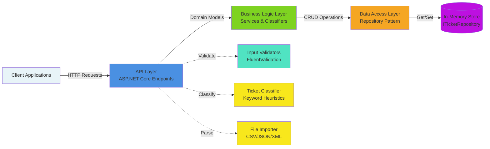
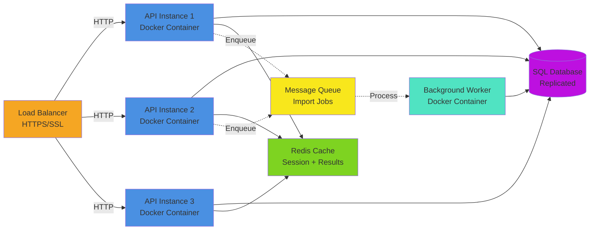

# Architecture Documentation: Support Ticket Management System

## System Overview

The Support Ticket Management System is built using a **three-tier layered architecture** with clear separation of concerns:



---

## Layer Responsibilities

### 1. API Layer (Presentation)

**Location**: `src/Homework2.Api/`

Handles HTTP requests, response formatting, and routing.

**Key Components**:

- **Endpoints** (`Endpoints/TicketsEndpoints.cs`):
  - `CreateTicket`: POST /tickets — Create new ticket
  - `GetAllTickets`: GET /tickets — List tickets with filtering
  - `GetTicketById`: GET /tickets/{id} — Retrieve single ticket
  - `UpdateTicket`: PUT /tickets/{id} — Update ticket
  - `DeleteTicket`: DELETE /tickets/{id} — Delete ticket

- **Import Endpoint** (`Endpoints/TicketsImportEndpoint.cs`):
  - `ImportTickets`: POST /tickets/import — Batch import CSV/JSON/XML

- **Classification Endpoint** (`Endpoints/TicketsClassifyEndpoint.cs`):
  - `AutoClassify`: POST /tickets/{id}/auto-classify — Auto-classify ticket

- **Models** (`Models/TicketDtos.cs`):
  - `CreateTicketRequest`: Input DTO for ticket creation
  - `UpdateTicketRequest`: Input DTO for ticket updates
  - `TicketResponse`: Output DTO for all responses

- **Validators** (`Validators/TicketValidator.cs`):
  - Validates all incoming requests using FluentValidation
  - Ensures email format, string lengths, required fields
  - Validates enum values for category/priority

**Responsibilities**:
- Parse incoming HTTP requests
- Validate request structure (FluentValidation)
- Convert DTOs to/from domain models
- Return appropriate HTTP status codes (201, 200, 400, 404, etc.)
- Handle exceptions and return error responses

---

### 2. Business Logic Layer (Service Layer)

**Location**: `src/Homework2.Bll/Services/`

Contains all business logic, orchestration, and domain services.

**Key Components**:

- **TicketService** (`Services/TicketService.cs`):
  ```
  - CreateAsync(customerId, email, name, subject, description, category, priority)
    Returns: Ticket (with auto-generated ID, timestamps)
  
  - GetByIdAsync(id)
    Returns: Ticket or null
  
  - GetAllAsync(categoryFilter?, priorityFilter?, statusFilter?)
    Returns: IReadOnlyList<Ticket> (filtered results)
  
  - UpdateAsync(id, subject?, description?, category?, priority?, status?, assignedTo?, tags?)
    Returns: Ticket or null (partial updates supported)
  
  - DeleteAsync(id)
    Returns: bool (success/failure)
  ```

- **TicketClassifier** (`Services/TicketClassifier.cs`):
  - Analyzes ticket subject/description for keywords
  - Maps keywords to category and priority
  - Returns confidence score (0.0-1.0)
  - Provides reasoning for classification
  - Uses deterministic keyword matching (no ML model)

- **TicketImportService** (`Services/TicketImportService.cs`):
  - Detects file format by extension (csv, json, xml)
  - Parses file into individual records
  - Validates each record
  - Creates tickets in bulk
  - Returns summary: successful count, failed count, error messages

- **Domain Models** (`Domain/Ticket.cs`):
  - `Ticket`: Core domain record with all ticket properties
  - `Category`: Enum (AccountAccess, TechnicalIssue, BillingQuestion, FeatureRequest, BugReport, Other)
  - `Priority`: Enum (Low, Medium, High, Urgent)
  - `Status`: Enum (New, InProgress, WaitingCustomer, Resolved, Closed)
  - `Metadata`: Additional ticket metadata (source, browser, deviceType)
  - `ClassificationResult`: Result of classification with confidence/reasoning

**Responsibilities**:
- Orchestrate business logic (create, update, delete)
- Validate domain rules
- Generate UUIDs and timestamps
- Implement filtering logic
- Handle classification logic
- Parse import files

---

### 3. Data Access Layer (Repository Pattern)

**Location**: `src/Homework2.Bll/Abstractions/`

Abstracts data storage from business logic.

**Key Components**:

- **ITicketRepository** (Interface):
  ```csharp
  Task<Ticket> CreateAsync(Ticket ticket);
  Task<Ticket?> GetByIdAsync(Guid id);
  Task<IReadOnlyList<Ticket>> GetAllAsync();
  Task<Ticket?> UpdateAsync(Ticket ticket);
  Task<bool> DeleteAsync(Guid id);
  ```

- **In-Memory Implementation**:
  - Stores tickets in a `Dictionary<Guid, Ticket>`
  - Thread-safe operations using `SemaphoreSlim`
  - No external database dependency
  - Perfect for testing and demonstrations

**Responsibilities**:
- Store and retrieve tickets
- Persist changes to storage
- Query tickets by criteria

---

## Data Flow

### Creating a Ticket

```
POST /tickets with CreateTicketRequest
    ↓
TicketsEndpoint.CreateTicket()
    ↓
TicketValidator validates request
    ↓
TicketService.CreateAsync()
    ↓
Generate Guid, DateTimeOffset
    ↓
Create Ticket domain model
    ↓
ITicketRepository.CreateAsync()
    ↓
Store in memory
    ↓
Convert Ticket → TicketResponse
    ↓
Return 201 Created with response
```

### Filtering Tickets

```
GET /tickets?priority=high&status=new
    ↓
Parse query parameters
    ↓
TicketService.GetAllAsync(priorityFilter, statusFilter)
    ↓
ITicketRepository.GetAllAsync()
    ↓
Return all tickets from memory
    ↓
Filter by priority and status in C#
    ↓
Convert Ticket[] → TicketResponse[]
    ↓
Return 200 OK with array
```

### Auto-Classifying a Ticket

```
POST /tickets/{id}/auto-classify
    ↓
TicketsClassifyEndpoint.AutoClassify()
    ↓
TicketService.GetByIdAsync(id)
    ↓
Retrieve ticket from repository
    ↓
TicketClassifier.Classify(ticket)
    ↓
Analyze subject/description for keywords
    ↓
Map keywords → category + priority + confidence
    ↓
TicketService.UpdateAsync(id, newCategory, newPriority)
    ↓
Return ClassificationResultResponse
    ↓
Return 200 OK
```

### Batch Importing Tickets

```
POST /tickets/import (multipart file)
    ↓
TicketsImportEndpoint.ImportTickets()
    ↓
Detect file extension (csv, json, xml)
    ↓
TicketImportService.ImportAsync(stream, extension)
    ↓
Parse file format:
  - CSV: CsvHelper to read rows
  - JSON: JsonSerializer to deserialize array
  - XML: XDocument to parse XML
    ↓
For each record:
  Validate format
  Create CreateTicketRequest
  TicketService.CreateAsync()
    ↓
Collect successful and failed imports
    ↓
Return ImportResult (successful, failed, errors)
```

---

## Design Patterns

### 1. Layered Architecture

Separates concerns into three independent layers that communicate through clearly defined interfaces.

**Benefits**:
- Easy to test (mock lower layers)
- Easy to swap implementations (e.g., database provider)
- Clear responsibility boundaries

### 2. Repository Pattern

Abstracts data access behind `ITicketRepository` interface.

```csharp
public interface ITicketRepository
{
    Task<Ticket> CreateAsync(Ticket ticket);
    Task<Ticket?> GetByIdAsync(Guid id);
    Task<IReadOnlyList<Ticket>> GetAllAsync();
    Task<Ticket?> UpdateAsync(Ticket ticket);
    Task<bool> DeleteAsync(Guid id);
}
```

**Benefits**:
- Easy to mock for testing
- Can swap in different database implementations
- Single responsibility: data access

### 3. Dependency Injection

ASP.NET Core's DI container manages service lifetimes:

```csharp
// Scoped: one instance per HTTP request
services.AddScoped<TicketService>();
services.AddScoped<TicketClassifier>();

// Singleton: one instance for entire application
services.AddSingleton<ITicketRepository>(
    new InMemoryTicketRepository()
);
```

**Benefits**:
- Loose coupling between components
- Easy to mock dependencies in tests
- Centralized lifecycle management

### 4. Record Types for DTOs

Immutable records provide:
```csharp
record CreateTicketRequest(
    string CustomerId,
    string CustomerEmail,
    // ...
);
```

**Benefits**:
- Concise syntax
- Value equality by default
- Immutability prevents accidental mutations
- Auto-generated `ToString()` for debugging

### 5. Async/Await

All I/O operations are asynchronous:

```csharp
public async Task<Ticket?> GetByIdAsync(Guid id)
{
    return await _repository.GetByIdAsync(id);
}
```

**Benefits**:
- Non-blocking I/O (threads available for other requests)
- Better scalability under load
- Natural exception handling with try/catch

---

## Key Design Decisions

### 1. In-Memory Storage

**Decision**: Use in-memory `Dictionary<Guid, Ticket>` instead of external database.

**Rationale**:
- Eliminates external dependencies (no SQL Server, PostgreSQL setup)
- Faster testing (no DB migration scripts)
- Simple, deterministic behavior (easier to verify in tests)
- Sufficient for assignment scope (single server, no persistence required)

**Tradeoff**:
- Data lost when application restarts
- Not suitable for production multi-instance deployments
- No transaction support needed for this scope

### 2. Keyword-Based Classification

**Decision**: Use deterministic keyword matching instead of ML model.

**Rationale**:
- Transparent, auditable classification logic
- No model training/inference latency
- Deterministic results (same input → same output)
- Easy to verify in automated tests
- Simple business rules (keywords → category)

**Example Keywords**:
```
Category: Billing
  Keywords: payment, invoice, refund, billing, charge, subscription, card, bank

Category: Account Access
  Keywords: password, login, account, locked, 2fa, authentication, access, sign-in

Category: Bug Report
  Keywords: bug, error, crash, exception, broken, fail, issue
```

**Tradeoff**:
- Less sophisticated than ML (false positives/negatives)
- Requires manual keyword list maintenance
- Not adaptive to new terminology

### 3. CSV/JSON/XML Import Support

**Decision**: Support three file formats for batch import.

**Rationale**:
- CSV: Legacy systems, spreadsheet exports
- JSON: Modern APIs, native format for web apps
- XML: Enterprise systems, B2B integrations
- Demonstrates format flexibility in one codebase

**Implementation**:
- Detect format by file extension
- Use format-specific parsers (CsvHelper, JsonSerializer, XDocument)
- Validate each record individually
- Return partial success (some rows may fail)

---

## Scalability Considerations

### Current Limitations

1. **Single Server**: In-memory storage can't be shared across servers
2. **No Pagination**: Loading all tickets into memory is inefficient at scale
3. **No Caching**: Classification runs every time; no memoization
4. **No Rate Limiting**: Vulnerable to abuse

### Future Improvements

1. **Add SQL Database**:
   ```csharp
   services.AddScoped<ITicketRepository, SqlTicketRepository>();
   ```

2. **Add Pagination**:
   ```csharp
   GET /tickets?page=1&pageSize=50
   ```

3. **Add Caching**:
   ```csharp
   // Cache classification results
   var cached = _cache.Get($"classify_{ticketId}");
   ```

4. **Add Rate Limiting**:
   ```csharp
   services.AddRateLimiter(options => { ... });
   ```

5. **Add Async Queue for Imports**:
   ```csharp
   // Queue large imports to background job
   _jobQueue.Enqueue(importJob);
   ```

---

## Security Considerations

### Current Implementation

1. **Input Validation**: FluentValidation on all endpoints
2. **Enum Validation**: Only accept valid category/priority/status values
3. **Email Validation**: RFC-compliant email format checking
4. **Error Messages**: Generic error responses (no information leakage)

### Future Hardening

1. **Authentication**: OAuth 2.0 / JWT tokens
2. **Authorization**: Role-based access control (support agent vs. customer)
3. **HTTPS**: Encrypt all traffic (TLS 1.3)
4. **Rate Limiting**: Prevent abuse (1000 req/min per IP)
5. **Audit Logging**: Track all changes (who, when, what)
6. **Input Sanitization**: Additional escaping for XSS/SQL injection prevention

---

## Testing Strategy

### Unit Tests

Test individual services in isolation:

```csharp
[Fact]
public async Task CreateTicket_WithValidRequest_ReturnsTicketWithId()
{
    // Arrange
    var service = new TicketService(mockRepository);
    
    // Act
    var ticket = await service.CreateAsync(
        "CUST-001", "john@example.com", "John", 
        "Subject", "Description", Category.BugReport, Priority.High
    );
    
    // Assert
    ticket.Id.Should().NotBeEmpty();
    ticket.Status.Should().Be(Status.New);
}
```

### Integration Tests

Test full request/response cycle:

```csharp
[Fact]
public async Task CreateTicket_ReturnsCreatedStatus()
{
    // Arrange
    var client = _factory.CreateClient();
    var request = new { customerId = "CUST-001", ... };
    
    // Act
    var response = await client.PostAsJsonAsync("/tickets", request);
    
    // Assert
    response.StatusCode.Should().Be(HttpStatusCode.Created);
}
```

### Coverage Goals

- **API Layer**: 100% (all endpoints tested)
- **Service Layer**: 100% (all business logic paths)
- **Import Logic**: Edge cases (invalid CSV, malformed JSON, etc.)
- **Classification**: All keyword categories covered

---

## Performance Profile

### Typical Response Times (in-memory, single server)

| Operation | Time | Notes |
|-----------|------|-------|
| Create ticket | < 1ms | Generates UUID, stores in memory |
| Get ticket by ID | < 1ms | Dictionary lookup |
| List 1000 tickets | < 10ms | Filter in memory |
| Filter by priority | < 10ms | Enum comparison |
| Classify ticket | < 5ms | Keyword string matching |
| Import 100 tickets | < 50ms | Parse + create batch |

### Memory Usage

- Per ticket: ~500 bytes (GUID, strings, enums, timestamps)
- 1000 tickets: ~500 KB
- 10,000 tickets: ~5 MB
- 100,000 tickets: ~50 MB

---

## Deployment Architecture

For production deployment:



### Components

1. **Load Balancer**: Distribute traffic across instances
2. **API Instances**: Stateless containers (can scale horizontally)
3. **SQL Database**: Central data store (PostgreSQL or SQL Server)
4. **Redis Cache**: Session state + classification cache
5. **Message Queue**: Async import processing (RabbitMQ or Azure Service Bus)
6. **Background Worker**: Process bulk imports asynchronously

---

## References

- Clean Architecture: [Uncle Bob](https://blog.cleancoder.com/uncle-bob/2012/08/13/the-clean-architecture.html)
- Repository Pattern: [Microsoft Docs](https://docs.microsoft.com/en-us/dotnet/architecture/microservices/microservice-ddd-cqrs-patterns/infrastructure-persistence-layer-design)
- Async/Await: [Microsoft Docs](https://docs.microsoft.com/en-us/dotnet/csharp/asynchronous-programming/)
