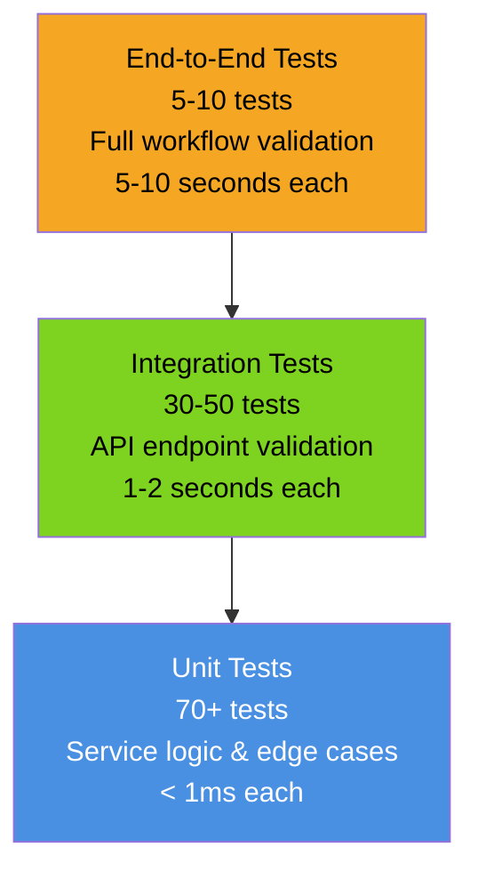

# Testing Strategy: Support Ticket Management System

## Test Pyramid



## Overview

The Support Ticket Management System uses a **three-tier testing strategy**:

### Unit Tests (70+ tests)
- Test individual services in isolation
- Mock dependencies (repository, validator)
- Verify business logic, edge cases, error handling
- Fast execution (< 1ms per test)
- Located in `Homework2.Tests/Unit/`

### Integration Tests (30-50 tests)
- Test full API endpoint behavior
- Use real in-memory repository
- Verify request/response serialization
- Test validation, error responses, status codes
- Located in `Homework2.Tests/Integration/`

### End-to-End Tests (5-10 tests)
- Test complete workflows
- Scenario-driven (create → update → classify → delete)
- Verify cross-endpoint interactions
- Located in `Homework2.Tests/E2E/`

---

## Running Tests

### Run All Tests

```powershell
cd "D:\Work\learn\Courses\AI -set\lecture-1\vb_gen-ai-software-engineering\homework-2"
dotnet test
```

**Expected Output**:
```
Test Run Successful.
Total tests: 120+
     Passed: 120+
     Failed: 0
     Skipped: 0
Time Elapsed 00:00:XX.XXXXXX
```

### Run Specific Test Category

```powershell
# Unit tests only
dotnet test --filter "Category=Unit"

# Integration tests only
dotnet test --filter "Category=Integration"

# E2E tests only
dotnet test --filter "Category=E2E"
```

### Run Tests with Verbose Output

```powershell
dotnet test --verbosity detailed
```

Shows each test name and result as it runs.

### Run Tests with Code Coverage

```powershell
dotnet test /p:CollectCoverage=true /p:CoverageFormat=opencover /p:Threshold=80
```

Generates coverage report showing:
- Lines covered vs. lines total
- Branch coverage
- Method coverage
- Coverage by file

### Run a Single Test

```powershell
dotnet test --filter "FullyQualifiedName~CreateTicket_WithValidRequest_ReturnsTicketWithId"
```

### Run Tests Matching a Pattern

```powershell
# All classification tests
dotnet test --filter "FullyQualifiedName~Classifier"

# All validation tests
dotnet test --filter "FullyQualifiedName~Validation"
```

---

## Unit Tests

Unit tests verify individual service methods in isolation, using mocks for dependencies.

### TicketService Unit Tests

#### Test: Create Ticket with Valid Data

```csharp
[Fact]
[Category("Unit")]
public async Task CreateTicket_WithValidData_ReturnsTicketWithGeneratedId()
{
    // Arrange
    var mockRepository = new Mock<ITicketRepository>();
    var service = new TicketService(mockRepository.Object);

    // Act
    var ticket = await service.CreateAsync(
        customerId: "CUST-001",
        customerEmail: "john@example.com",
        customerName: "John Doe",
        subject: "Cannot login",
        description: "I'm locked out of my account",
        category: Category.AccountAccess,
        priority: Priority.High
    );

    // Assert
    ticket.Id.Should().NotBeEmpty();
    ticket.Status.Should().Be(Status.New);
    ticket.CreatedAt.Should().BeLessThanOrEqualTo(DateTimeOffset.UtcNow);
    mockRepository.Verify(r => r.CreateAsync(ticket), Times.Once);
}
```

**Verifies**:
- Ticket ID is auto-generated (non-empty GUID)
- Status defaults to "New"
- Timestamps are set correctly
- Repository is called exactly once

#### Test: Update Ticket - Partial Update

```csharp
[Fact]
[Category("Unit")]
public async Task UpdateTicket_WithPartialData_UpdatesOnlyProvidedFields()
{
    // Arrange
    var mockRepository = new Mock<ITicketRepository>();
    var existingTicket = new Ticket(
        Id: Guid.NewGuid(),
        CustomerId: "CUST-001",
        CustomerEmail: "john@example.com",
        CustomerName: "John Doe",
        Subject: "Original Subject",
        Description: "Original Description",
        Category: Category.Other,
        Priority: Priority.Low,
        Status: Status.New,
        CreatedAt: DateTimeOffset.UtcNow,
        UpdatedAt: DateTimeOffset.UtcNow,
        ResolvedAt: null,
        AssignedTo: null,
        Tags: Array.Empty<string>(),
        Metadata: new(Source: "web", Browser: "Chrome", DeviceType: "desktop")
    );

    mockRepository.Setup(r => r.GetByIdAsync(existingTicket.Id))
        .ReturnsAsync(existingTicket);

    var service = new TicketService(mockRepository.Object);

    // Act
    var updated = await service.UpdateAsync(
        id: existingTicket.Id,
        subject: "Updated Subject",
        status: Status.InProgress,
        assignedTo: "support-team-1"
    );

    // Assert
    updated.Subject.Should().Be("Updated Subject");
    updated.Status.Should().Be(Status.InProgress);
    updated.AssignedTo.Should().Be("support-team-1");
    updated.Description.Should().Be("Original Description"); // Unchanged
    updated.Priority.Should().Be(Priority.Low); // Unchanged
}
```

**Verifies**:
- Only provided fields are updated
- Omitted fields retain original values
- Timestamps are updated

#### Test: Get All Tickets - Filtering

```csharp
[Fact]
[Category("Unit")]
public async Task GetAllTickets_WithPriorityFilter_ReturnsOnlyHighPriorityTickets()
{
    // Arrange
    var mockRepository = new Mock<ITicketRepository>();
    var tickets = new List<Ticket>
    {
        new Ticket(/* High priority */),
        new Ticket(/* Low priority */),
        new Ticket(/* High priority */),
    };
    mockRepository.Setup(r => r.GetAllAsync())
        .ReturnsAsync(tickets.AsReadOnly());

    var service = new TicketService(mockRepository.Object);

    // Act
    var filtered = await service.GetAllAsync(priorityFilter: Priority.High);

    // Assert
    filtered.Should().HaveCount(2);
    filtered.Should().AllSatisfy(t => t.Priority.Should().Be(Priority.High));
}
```

**Verifies**:
- Filtering by single criterion works
- Correct records are returned
- Non-matching records are excluded

### TicketClassifier Unit Tests

#### Test: Classify Ticket - Billing Keywords

```csharp
[Fact]
[Category("Unit")]
public void ClassifyTicket_WithBillingKeywords_ReturnsBillingCategory()
{
    // Arrange
    var classifier = new TicketClassifier();
    var ticket = new Ticket(
        Id: Guid.NewGuid(),
        CustomerId: "CUST-001",
        CustomerEmail: "john@example.com",
        CustomerName: "John Doe",
        Subject: "Payment processing error",
        Description: "I was charged twice for my subscription. Please refund the duplicate charge to my card.",
        Category: Category.Other,
        Priority: Priority.Medium,
        Status: Status.New,
        CreatedAt: DateTimeOffset.UtcNow,
        UpdatedAt: DateTimeOffset.UtcNow,
        ResolvedAt: null,
        AssignedTo: null,
        Tags: Array.Empty<string>(),
        Metadata: new(Source: "web", Browser: null, DeviceType: null)
    );

    // Act
    var result = classifier.Classify(ticket);

    // Assert
    result.Category.Should().Be(Category.BillingQuestion);
    result.Priority.Should().Be(Priority.High); // Urgent billing issue
    result.Confidence.Should().BeGreaterThan(0.8);
    result.KeywordsFound.Should().Contain(new[] { "charged", "refund", "subscription" });
}
```

**Verifies**:
- Correct category detection
- Correct priority assignment
- Confidence score is reasonable
- Keywords are identified

#### Test: Classify Ticket - No Matching Keywords

```csharp
[Fact]
[Category("Unit")]
public void ClassifyTicket_WithNoMatchingKeywords_ReturnsOtherCategory()
{
    // Arrange
    var classifier = new TicketClassifier();
    var ticket = new Ticket(
        // Subject and description with no special keywords
        Subject: "Hello",
        Description: "Just saying hi",
        // ... other fields
    );

    // Act
    var result = classifier.Classify(ticket);

    // Assert
    result.Category.Should().Be(Category.Other);
    result.Confidence.Should().BeLessThan(0.5);
    result.KeywordsFound.Should().BeEmpty();
}
```

**Verifies**:
- Default category when no keywords match
- Low confidence for ambiguous content

### Validator Unit Tests

#### Test: CreateTicketRequest Validation - Invalid Email

```csharp
[Fact]
[Category("Unit")]
public async Task ValidateCreateTicketRequest_WithInvalidEmail_ReturnsValidationError()
{
    // Arrange
    var validator = new TicketValidator();
    var request = new CreateTicketRequest(
        CustomerId: "CUST-001",
        CustomerEmail: "not-an-email", // Invalid!
        CustomerName: "John Doe",
        Subject: "Test",
        Description: "Test description"
    );

    // Act
    var result = await validator.ValidateAsync(request);

    // Assert
    result.IsValid.Should().BeFalse();
    result.Errors.Should().Contain(e => e.PropertyName == nameof(CreateTicketRequest.CustomerEmail));
}
```

**Verifies**:
- Invalid email is rejected
- Validation error is specific to email field

#### Test: UpdateTicketRequest Validation - Subject Too Long

```csharp
[Fact]
[Category("Unit")]
public async Task ValidateUpdateTicketRequest_WithSubjectTooLong_ReturnsValidationError()
{
    // Arrange
    var validator = new TicketValidator();
    var request = new UpdateTicketRequest(
        Subject: new string('x', 201) // Max is 200
    );

    // Act
    var result = await validator.ValidateAsync(request);

    // Assert
    result.IsValid.Should().BeFalse();
    result.Errors.Should().Contain(e => e.PropertyName == nameof(UpdateTicketRequest.Subject));
}
```

**Verifies**:
- String length validation works
- Appropriate error message

---

## Integration Tests

Integration tests verify complete API endpoint behavior with realistic HTTP requests.

### Create Ticket Integration Test

```csharp
[Fact]
[Category("Integration")]
public async Task CreateTicket_WithValidRequest_Returns201Created()
{
    // Arrange
    var client = _factory.CreateClient();
    var request = new
    {
        customerId = "CUST-001",
        customerEmail = "john@example.com",
        customerName = "John Doe",
        subject = "Cannot login",
        description = "I'm locked out",
        category = "account_access",
        priority = "high"
    };

    // Act
    var response = await client.PostAsJsonAsync("/tickets", request);
    var content = await response.Content.ReadAsAsync<dynamic>();

    // Assert
    response.StatusCode.Should().Be(HttpStatusCode.Created);
    response.Headers.Location.Should().NotBeNull();
    content.id.Should().NotBeNull();
    content.status.Should().Be("new");
}
```

**Verifies**:
- HTTP 201 Created status
- Location header points to new resource
- Response contains ticket ID and default status

### Filtering Tickets Integration Test

```csharp
[Fact]
[Category("Integration")]
public async Task GetAllTickets_WithPriorityFilter_ReturnsFilteredResults()
{
    // Arrange
    var client = _factory.CreateClient();
    
    // Create some test tickets
    await CreateTicketAsync(client, "High Priority Issue", priority: "high");
    await CreateTicketAsync(client, "Low Priority Issue", priority: "low");
    await CreateTicketAsync(client, "Another High Priority", priority: "high");

    // Act
    var response = await client.GetAsync("/tickets?priority=high");
    var tickets = await response.Content.ReadAsAsync<List<dynamic>>();

    // Assert
    response.StatusCode.Should().Be(HttpStatusCode.OK);
    tickets.Should().HaveCount(2);
    tickets.Should().AllSatisfy(t => t.priority.Should().Be("high"));
}
```

**Verifies**:
- Query parameter filtering works
- Correct tickets are returned
- Response structure is correct

### Auto-Classify Integration Test

```csharp
[Fact]
[Category("Integration")]
public async Task AutoClassifyTicket_WithBillingIssue_ReturnsCorrectClassification()
{
    // Arrange
    var client = _factory.CreateClient();
    var ticket = await CreateTicketAsync(client, 
        subject: "Double charge on my account",
        description: "I was billed twice for my subscription this month"
    );

    // Act
    var response = await client.PostAsync($"/tickets/{ticket.id}/auto-classify", null);
    var classification = await response.Content.ReadAsAsync<dynamic>();

    // Assert
    response.StatusCode.Should().Be(HttpStatusCode.OK);
    classification.category.Should().Be("billing_question");
    classification.priority.Should().Be("high");
    classification.confidence.Should().BeGreaterThan(0.8);
}
```

**Verifies**:
- Classification endpoint works end-to-end
- Correct category/priority assigned
- Response includes confidence score

### Import Tickets Integration Test

```csharp
[Fact]
[Category("Integration")]
public async Task ImportTickets_WithValidCSV_ReturnsSuccessCount()
{
    // Arrange
    var client = _factory.CreateClient();
    var csv = @"CustomerId,CustomerEmail,CustomerName,Subject,Description,Category,Priority
CUST-001,john@example.com,John Doe,Test 1,Description 1,billing_question,high
CUST-002,jane@example.com,Jane Smith,Test 2,Description 2,bug_report,medium";

    // Act
    using var content = new MultipartFormDataContent();
    content.Add(new StringContent(csv), "file", "sample.csv");
    var response = await client.PostAsync("/tickets/import", content);
    var result = await response.Content.ReadAsAsync<dynamic>();

    // Assert
    response.StatusCode.Should().Be(HttpStatusCode.OK);
    result.successful.Should().Be(2);
    result.failed.Should().Be(0);
}
```

**Verifies**:
- Import endpoint accepts file
- CSV is parsed correctly
- Results include success/failure counts

---

## Edge Cases & Error Scenarios

### Test: Create Ticket with Missing Required Field

```csharp
[Fact]
[Category("Unit")]
public async Task CreateTicket_WithMissingSubject_ReturnsValidationError()
{
    // Arrange
    var validator = new TicketValidator();
    var request = new CreateTicketRequest(
        CustomerId: "CUST-001",
        CustomerEmail: "john@example.com",
        CustomerName: "John Doe",
        Subject: "", // Empty!
        Description: "Description"
    );

    // Act
    var result = await validator.ValidateAsync(request);

    // Assert
    result.IsValid.Should().BeFalse();
}
```

### Test: Get Non-Existent Ticket

```csharp
[Fact]
[Category("Integration")]
public async Task GetTicket_WithInvalidId_Returns404NotFound()
{
    // Arrange
    var client = _factory.CreateClient();
    var fakeId = Guid.NewGuid();

    // Act
    var response = await client.GetAsync($"/tickets/{fakeId}");

    // Assert
    response.StatusCode.Should().Be(HttpStatusCode.NotFound);
}
```

### Test: Update Non-Existent Ticket

```csharp
[Fact]
[Category("Integration")]
public async Task UpdateTicket_WithInvalidId_Returns404NotFound()
{
    // Arrange
    var client = _factory.CreateClient();
    var fakeId = Guid.NewGuid();
    var request = new { status = "resolved" };

    // Act
    var response = await client.PutAsJsonAsync($"/tickets/{fakeId}", request);

    // Assert
    response.StatusCode.Should().Be(HttpStatusCode.NotFound);
}
```

### Test: Import with Invalid CSV

```csharp
[Fact]
[Category("Integration")]
public async Task ImportTickets_WithMalformedCSV_ReturnsPartialSuccess()
{
    // Arrange
    var client = _factory.CreateClient();
    var csv = @"CustomerId,CustomerEmail,CustomerName,Subject,Description
CUST-001,invalid-email,John Doe,Test,Description"; // Invalid email

    // Act
    using var content = new MultipartFormDataContent();
    content.Add(new StringContent(csv), "file", "invalid.csv");
    var response = await client.PostAsync("/tickets/import", content);
    var result = await response.Content.ReadAsAsync<dynamic>();

    // Assert
    result.failed.Should().Be(1);
    result.errors.Should().NotBeEmpty();
}
```

---

## Sample Data

### Sample CSV (50 rows)

Located at: `demo/sample_tickets.csv`

Format:
```
CustomerId,CustomerEmail,CustomerName,Subject,Description,Category,Priority,Tags
CUST-001,alice@example.com,Alice Johnson,Cannot login,I'm locked out of my account,account_access,high,"urgent,account"
CUST-002,bob@example.com,Bob Smith,Payment failed,My payment card was declined,billing_question,high,"payment,billing"
...
```

### Sample JSON (20 entries)

Located at: `demo/sample_tickets.json`

Format:
```json
[
  {
    "customerId": "CUST-001",
    "customerEmail": "alice@example.com",
    "customerName": "Alice Johnson",
    "subject": "Cannot login",
    "description": "I'm locked out",
    "category": "account_access",
    "priority": "high"
  },
  ...
]
```

### Sample XML (30 entries)

Located at: `demo/sample_tickets.xml`

Format:
```xml
<?xml version="1.0" encoding="utf-8"?>
<tickets>
  <ticket>
    <customerId>CUST-001</customerId>
    <customerEmail>alice@example.com</customerEmail>
    <customerName>Alice Johnson</customerName>
    <subject>Cannot login</subject>
    <description>I'm locked out</description>
    <category>account_access</category>
    <priority>high</priority>
  </ticket>
  ...
</tickets>
```

---

## Manual Testing Checklist

Use this checklist when manually testing the API:

### CRUD Operations
- [ ] Create ticket with all fields
- [ ] Create ticket with minimal fields (only required)
- [ ] View list of all tickets
- [ ] Filter by category
- [ ] Filter by priority
- [ ] Filter by status
- [ ] Get single ticket by ID
- [ ] Update ticket status
- [ ] Update ticket with partial data
- [ ] Delete ticket
- [ ] Verify deleted ticket returns 404

### Validation
- [ ] Create ticket with invalid email → 400 Bad Request
- [ ] Create ticket with empty subject → 400 Bad Request
- [ ] Create ticket with very long description → 400 Bad Request
- [ ] Update with invalid category enum → 400 Bad Request
- [ ] Update with invalid priority enum → 400 Bad Request

### Import
- [ ] Import CSV with valid data → 200 OK with success count
- [ ] Import JSON with valid data → 200 OK with success count
- [ ] Import XML with valid data → 200 OK with success count
- [ ] Import CSV with invalid email → Partial success with errors
- [ ] Import without file → 400 Bad Request
- [ ] Import empty file → 400 Bad Request

### Classification
- [ ] Classify ticket with account keywords → account_access category
- [ ] Classify ticket with billing keywords → billing_question category
- [ ] Classify ticket with bug keywords → bug_report category
- [ ] Classify non-existent ticket → 404 Not Found
- [ ] Verify classification updates ticket's category/priority

### Performance
- [ ] Create 100 tickets → completes in < 1 second
- [ ] List 1000 tickets → completes in < 1 second
- [ ] Import 500 tickets → completes in < 5 seconds
- [ ] Filter large list → completes in < 100ms

---

## Coverage Goals

### Target Coverage

- **Overall**: 80%+ line coverage
- **API Layer**: 100% (all endpoints tested)
- **Service Layer**: 100% (all business logic)
- **Validators**: 100% (all validation rules)
- **Classifiers**: 90%+ (all categories covered)

### Measuring Coverage

```powershell
dotnet test /p:CollectCoverage=true /p:CoverageFormat=opencover

# View generated report
notepad coverage\results\coverage.txt
```

Reports include:
- Lines covered vs. total
- Branch coverage percentage
- Coverage by file
- Coverage by method

---

## Continuous Integration

In a production CI/CD pipeline, tests should:

1. Run on every commit
2. Block merge if coverage drops below 80%
3. Report coverage trend over time
4. Run in parallel (xUnit supports this)
5. Generate HTML report for review

Example GitHub Actions workflow:

```yaml
- name: Run Tests
  run: dotnet test /p:CollectCoverage=true

- name: Check Coverage
  run: |
    if [ $(grep "Line coverage" coverage/results/coverage.txt | awk '{print $NF}') -lt 80 ]; then
      exit 1
    fi
```

---

## Further Reading

- **xUnit Docs**: [xunit.net](https://xunit.net/)
- **FluentAssertions**: [fluentassertions.com](https://fluentassertions.com/)
- **Moq**: [github.com/moq/moq4](https://github.com/moq/moq4)
- **Microsoft Testing Docs**: [Unit testing best practices](https://docs.microsoft.com/en-us/dotnet/core/testing/)
